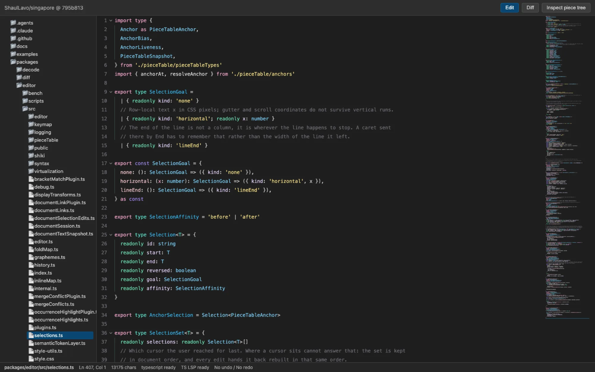

# singapore

a code editor for the browser, in packages you add one at a time

named after monaco. another editor, another city-state

a piece table holds the text, the css highlight api paints it, and tree-sitter and lsp are plugins you opt into. the core owns the document and the editing runtime, nothing else. it never touches persistence. you hand it text and decide where files live

still moving. package boundaries change between commits



## try it

[the demo](https://shaullavo.github.io/singapore/) pulls this repo from the github api and opens files in the editor. the piece tree inspector in the top right shows the document model under whatever you type

## embedding it

not on npm under this name yet. the last published releases sit on the old `@singapor` scope, the typo this rename exists to fix. for now, clone and `bun link`

the core is one class and one stylesheet

```ts
import { Editor } from '@singapore-editor/core/editor'
import '@singapore-editor/core/style.css'

const editor = new Editor(document.querySelector('#editor')!)
editor.openDocument({
  documentId: 'example.ts',
  text: 'const value = 1;\n',
  languageId: 'typescript',
})
```

that is the whole thing. line numbers, find, minimap, folds, syntax and language servers are separate packages, and none of them load until you register them

## concepts

### documents

a document is text plus an id and a language. the text lives in a treap-backed piece table, so an edit allocates a few nodes instead of copying the buffer, and every read is a snapshot that will not change under you. `openDocument` is how one starts existing

### anchors

an offset into a document goes stale the moment someone types above it. an anchor does not. it survives edits, carries a bias for which side of an insertion it belongs to, and is what selections, folds and decorations are built from

### selections

a selection knows more than start and end. it carries affinity, which side of a wrapped line the caret sits on, and a goal, the column a vertical run is trying to get back to. that second one is why holding down through a short line and out the other side lands where you expect

### plugins

gutters, view contributions, highlighters, themes, commands and language registration are plugin contracts on the core. the first-party packages use the same ones you would. there is no privileged internal path

### syntax

tree-sitter runs in a worker and streams highlights, folds and structural selection back. shiki is available instead for hosts that already tokenize that way. both are optional, and the editor renders text without either

## packages

| package | what it does |
| --- | --- |
| `@singapore-editor/core` | document model, anchors, selections, folds, transforms, virtualization, renderer, themes, plugin contracts |
| `@singapore-editor/gutters` | line numbers and fold arrows |
| `@singapore-editor/find` | find and replace |
| `@singapore-editor/markdown` | renders markdown as formatted text while the buffer keeps holding the source |
| `@singapore-editor/minimap` | minimap, rendered in a worker |
| `@singapore-editor/scope-lines` | indent scope lines |
| `@singapore-editor/tree-sitter` | tree-sitter runtime, worker client, language registry, structural selection |
| `@singapore-editor/tree-sitter-languages` | grammars and queries for javascript, typescript, html, css, json |
| `@singapore-editor/lsp` | language server transport and plugin primitives |
| `@singapore-editor/typescript-lsp` | the typescript language service on top of that layer |
| `@singapore-editor/diff` | diff rendering and diff gutters |
| `@singapore-editor/lsp-plugin` | the editor-side half of an lsp integration |
| `@singapore-editor/decode` | opens a file by writing it in, one character at a time |
| `@singapore-editor/panes` | split panes |
| `@singapore-editor/react`, `@singapore-editor/solid` | framework wrappers |

## running the repo

needs bun `1.3.10` or newer, and a browser with the css highlight api for the full rendering path. the browser tests need playwright's dependencies

```sh
bun install
bun run dev
```

`dev` runs turborepo. the demo lives in `examples/app` and vite serves it

```sh
bun run typecheck
bun run test
bun run lint
bun run build
```

some suites need a real browser, so they run per package

```sh
bun --cwd packages/minimap run test        # vitest, then the worker and renderer in chromium
bun --cwd packages/tree-sitter run test:browser
bun --cwd examples/app run test:e2e
```

## benchmarks

the parts that decide whether typing feels instant, measured on their own

```sh
bun --cwd packages/editor run bench:piece-table
bun --cwd packages/editor run bench:anchors
bun --cwd packages/editor run bench:fold-map
bun --cwd packages/editor run bench:transforms
bun --cwd packages/editor run bench:virtualization
bun --cwd packages/tree-sitter run bench:syntax
```

## docs

- [architecture](ARCHITECTURE.md), the main-thread and worker split, and the questions still open
- [progress](PROGRESS.md), what is implemented against what is only designed
- [piece table](docs/storage/piece-table.md), the treap storage model
- [positions](docs/positions/types-and-conversions.md) and [anchors](docs/positions/anchors.md)
- [selections and undo](docs/editing/selections-and-undo.md), affinity, normalization, history
- [transforms](docs/display/transforms.md) and [browser virtualization](docs/display/browser-virtualization.md), including bidi geometry
- [tree-sitter](docs/syntax/tree-sitter.md), the syntax engine
- [fregat's roadmap](https://github.com/ShaulLavo/fregat/blob/main/PLAN.md) sets execution order across both repos

## fair warning

this is tuned for design validation and performance work, not for a stable api. when they disagree, trust the tests over the docs. treat any version bump as breaking until that stops being true
