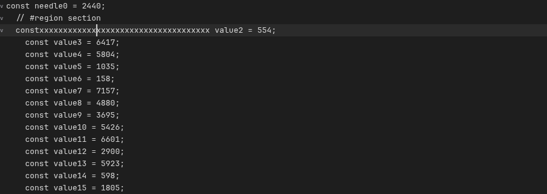

# E034 snapshot indentation folds

Snapshot indexing removes repeated whole-document scans from fallback folding.
The E034 browser comparison measures fallback folding on the same 500,000-line document before
and after the snapshot index. The baseline core is commit
`88cd55da61e895542cfe248082221cf992be74e5`, exported with `git archive` and rebuilt under
`/work/tmp/editor-e034/baseline-88cd55d-core`. The archive excludes the uncommitted E034 work.
The unrelated LSP changes do not enter this core build.

Earlier pilot runs used `30ae9ec`. Two concurrent viewport fixes, `b4ddbc3` and `6244aca`, then
changed when attachment measures and renders the initial visible rows. Comparing those pilots
with the later candidate would attribute viewport work to E034. The final comparison repeats
the baseline and control at `88cd55d`, which includes both fixes. The earlier runs remain under
`/work/tmp/editor-e034/historical-30ae9` and are excluded from the results below.

The runner is [`examples/stress/first-paint.mjs`](../../examples/stress/first-paint.mjs).
It builds against the selected core package and serves production assets through Playwright
request interception. It starts no server. Each result records source, core build, and browser
bundle hashes. The unchanged control uses the same frozen core.

## Folding contract

[`IndentationFoldIndex`](../../packages/editor/src/editor/indentationFoldIndex.ts) identifies a
generation by its immutable snapshot, language folding rules, and effective tab size. A numeric
revision or document ID alone cannot identify an undo branch. It stores 128-line immutable fact
blocks with stable line references and aggregate lengths. Persistent checkpoints preserve both
the bottom-up folding state and crossing-range rejection state. An edit reuses topology when its
blankness, indentation, and marker classification are unchanged. Semantic changes propagate until
the complete checkpoint state converges.

[`EditorFallbackFoldController`](../../packages/editor/src/editor/fallbackFoldController.ts) owns
the current index and one in-progress generation. Prepared documents own their index until transfer
or disposal. Replacement and cancellation discard unfinished work. Collapse intent stays in each
view's [`EditorFoldState`](../../packages/editor/src/editor/foldState.ts), separate from immutable
facts and topology.

With no structural session, fallback records `no-language` or `no-session`. Unsupported folding
and a terminal structural error also select it. Pending and supported structural sessions suppress
fallback, including supported empty results and incomplete viewport coverage. Explicit synchronous fold commands
finish any work needed for an exact answer. They can demand a complete cold discovery before
scheduled work has finished.

[`prepared.fallbackReady`](../../packages/editor/src/editor/preparedDocument.ts) resolves `true`
when the initial fallback index completes. Before completion, structural takeover, incomplete
transfer, or disposal resolves it `false`. Reading the promise does not force work. Ready compatible
metadata installs atomically. Incomplete metadata transfers its remaining work for deferred completion, and a
structural owner can discard optional fallback work.

Internal `headers`, `ranges`, and `ancestors` queries supply the view and fold commands without
flattening every fold. Explicit complete traversal serves fold-all and related commands. Public
marker arrays remain available through lazy queries. Updating marker coordinates without a changed
fold map refreshes mounted markers and preserves the editor's existing text render.
During a single edit, the view advances text layout, publishes the matching fallback state, and
paints text and markers together. A same-line edit preserves the in-place text patch and token
ordering. Publication skips a separate marker pass while that edit is painting; a changed fold
map queues the normal render.

## Fixture and measurements

`--fallback-cases` adds fixed indentation and explicit regions to the existing seeded E003
fixture. Top-level sections start every 5,000 rows. Nested headers occur every 500 rows, and
region comments span each section. The generator preserves exactly 500,000 rows and records
the fixture's SHA-256, `1e1bd3e405a41e11241ad87baacf631e877dccdef975eef36ee9aa59981ce3c9`.
The document has 14,829,434 UTF-16 code units and 1,200 folds. Browser runs use no language or
syntax provider, fixed tab size 4,
and a 900 by 320 pixel editor in a 1,000 by 1,000 pixel viewport.

Each production run records five cold samples and five warm samples for direct attachment
and prepared attachment. Each warm group first opens one unrecorded document. Direct and
prepared results remain separate because preparation happens before the attachment timer.
The final three production runs use `taskset -c 8,10,12,14`, four physical performance cores.
The runner records the inherited CPU affinity, and the comparison rejects mismatched affinities.

Unrestricted runs showed transient slowdowns in buffer creation, construction, attachment, and
input in both the unchanged control and candidate. Those runs preceded the final removal of unused
caret lookups from fold publication. They are retained as supplementary evidence:
[baseline](e034-unpinned-before.json.gz), [control](e034-unpinned-control.json.gz),
[candidate](e034-unpinned-after.json.gz), [repeated control](e034-unpinned-control-repeat.json.gz),
and [repeated candidate](e034-unpinned-after-repeat.json.gz). No individual samples were removed.
The final comparison reruns all three variants with the same affinity.
Separate host traces record load and CPU pressure every two seconds during the
[unrestricted repeat](e034-host-load-repeat.jsonl.gz) and
[initial pinned batch](e034-host-load-pinned.jsonl.gz), outside the application's timed paths.

The measurements have distinct boundaries.

- `textCallback` ends at the public initial text paint event. The screenshot completion time
  is a separate upper bound for visible text, including browser automation and screenshot work.
- `preparation` includes buffer creation and awaits `prepared.fallbackReady` before attachment.
  It reports preparation wall time. The baseline prepares synchronously and has no promise,
  so the same `await` completes immediately. Direct attachment reports zero preparation and
  includes buffer creation in its opening time.
- The first fold command runs after first text. It must synchronously discover any unfinished
  fallback work. The browser verifies that folding row 0 hides row 1 and reveals row 5,000.
- Each of three input bursts types twelve `x` characters inside an existing nested header,
  using real keyboard events 16 ms apart. `inputApplied` measures `beforeinput` to `onChange`.
  `inputFrame` measures `beforeinput` to the next animation frame requested from `onChange`.
  The browser waits 600 ms after each burst for deferred work.
- Fold-all runs after the bursts. Its displayed result must retain the same outer boundary.
  Unfold-all restores the text before the final screenshot.
- Heap measurements follow forced garbage collection, once after initial fold discovery and
  once after the input bursts. `Runtime.getHeapUsage` measures the browser main-thread JavaScript
  heap. Backing storage for arrays and external strings is reported separately; fixture strings can
  move between those categories. Neither number isolates the index. Index diagnostic byte estimates
  are reported separately.

The exact final text comparison runs after the measured input and commands. That check deliberately
materializes the document. It is benchmark verification, and is excluded from fallback-attributed
materializations. The benchmark also reconstructs its expected source string once after each of
the three bursts, outside the measured input intervals. These reference strings are separate from
index work. Disposal checks use weak references for the editor, buffer, and prepared document
after a worker idle fence and forced garbage collection.

Production timings disable the performance sink. Separate diagnostic runs retain every
`editor.fallbackFoldRanges` work summary and fallback-selection event. Baseline events contain
the old scanner's duration. Candidate summaries report snapshot reads, rebuilt and reused blocks,
propagation, fold count, retained bytes, materializations, and completion outcome.
Counters and `generationDurationMs` cover an index generation. Live `durationMs` covers only the
controller's work on that generation. A prepared adoption can therefore report historical reads
with zero controller duration. `counterScope` and `durationScope` label those boundaries. Preparation
and adoption events must not be summed as separate reads of the same generation.

## Reproduction

From the repository root, with workspace dependencies and the gutter package already built,
create the frozen core build:

```sh
mkdir -p /work/tmp/editor-e034/baseline-88cd55d-core
git archive 88cd55da61e895542cfe248082221cf992be74e5 \
	packages/editor/src packages/editor/package.json packages/editor/tsconfig.json |
	tar -x --strip-components=2 -C /work/tmp/editor-e034/baseline-88cd55d-core
ln -s "$PWD/packages/editor/node_modules" /work/tmp/editor-e034/baseline-88cd55d-core/node_modules
bun scripts/build-package.ts /work/tmp/editor-e034/baseline-88cd55d-core
```

The matched production command is:

```sh
taskset -c 8,10,12,14 bun run --cwd examples/stress bench:first-paint \
	--core-directory /work/tmp/editor-e034/baseline-88cd55d-core \
	--repetitions 5 --fixtures short-lines --plugins none --modes direct,prepared \
	--fallback-cases --output /work/tmp/editor-e034/baseline.json
```

The unchanged control changes only the output to `control.json`. The candidate omits
`--core-directory` and writes `candidate.json`. Diagnostic runs add `--diagnostics`, use one
repetition, omit `taskset`, and write separate files. `--fold-gutter` enables the built gutter package for
marker screenshots. Production runs omit the gutter so commands remain covered when no
gutter is installed.

The summary command is:

```sh
node examples/stress/fallback-compare.mjs \
	docs/performance/e034-before.json.gz \
	docs/performance/e034-control.json.gz \
	docs/performance/e034-after.json.gz
```

The summary rejects mismatched fixtures and incomplete samples. Percentiles use nearest-rank
selection. Each first-paint group has five samples, so its p95 is its maximum. Each input group
has 180 events. These are local observations, not a hardware-independent latency budget.

The browser is Chromium 153.0.8010.12 on Linux, with an Intel Core i7-14700K and 28 logical
CPUs. The machine has 33,369,657,344 bytes of RAM.

## Production latency and memory

The pinned baseline and control have identical source, core build, and browser bundle hashes.
Their core build hash starts `635937030cc7`; the candidate's starts `3ad3f4e5121b`.
Full identities and distributions are in [the comparison](e034-comparison.json), generated from
[baseline](e034-before.json.gz), [control](e034-control.json.gz), and [candidate](e034-after.json.gz).

Each cell below shows the text callback p95 / screenshot completion p95, in milliseconds.

| Attachment     |     Baseline |      Control |    Candidate |
| -------------- | -----------: | -----------: | -----------: |
| Direct, cold   | 56.0 / 128.7 | 58.5 / 131.6 | 59.2 / 136.1 |
| Direct, warm   | 38.9 / 100.7 | 38.7 / 105.6 | 38.8 / 106.9 |
| Prepared, cold |  18.9 / 94.1 |  18.4 / 92.8 |  17.7 / 91.4 |
| Prepared, warm |   8.1 / 72.8 |   8.1 / 76.5 |   8.8 / 74.4 |

Each input cell shows `beforeinput` to `onChange` p95 / next animation frame p95, in milliseconds.

| Attachment     |   Baseline |    Control |  Candidate |
| -------------- | ---------: | ---------: | ---------: |
| Direct, cold   | 1.5 / 10.2 | 1.6 / 12.6 | 1.5 / 15.0 |
| Direct, warm   | 1.0 / 13.7 | 1.0 / 13.3 |  1.1 / 9.9 |
| Prepared, cold | 1.5 / 10.6 | 1.4 / 10.7 | 1.5 / 14.4 |
| Prepared, warm | 0.9 / 13.1 | 0.9 / 12.7 | 0.9 / 10.1 |

Three candidate input application p95 values match the baseline. Warm direct input is 0.1 ms
higher, one observed timer increment. Callback p95 differences from the unchanged control range
from 0.7 ms lower to 0.7 ms higher. Five samples per attachment group cannot establish a small
latency shift or statistical equivalence. All candidate input-to-frame p95 values remain below
16.7 ms; this interval includes the wait for the next frame boundary. The evidence establishes
reduced repeated work, and does not claim a first-text or input speedup.

The following cells show median preparation / first fold command / fold-all, in milliseconds.
Preparation includes the buffer and completes before the attachment timer begins.

| Attachment     |          Baseline |           Control |         Candidate |
| -------------- | ----------------: | ----------------: | ----------------: |
| Direct, cold   |    0 / 81.7 / 6.2 |    0 / 82.4 / 6.2 |   0 / 124.6 / 8.4 |
| Direct, warm   |    0 / 58.2 / 4.8 |    0 / 53.6 / 4.8 |   0 / 116.7 / 6.6 |
| Prepared, cold | 119.1 / 2.2 / 6.1 | 119.3 / 2.2 / 6.2 | 181.6 / 1.5 / 9.0 |
| Prepared, warm |  83.2 / 1.2 / 4.8 |  84.9 / 1.2 / 4.8 | 156.4 / 0.9 / 6.5 |

Cold discovery and fold-all cost more. Ready preparation moves discovery before attachment and
reduces the first command's remaining work. It does not remove that preparation cost.

The memory cells show median initial / edited values in MiB, calculated per sample as JavaScript
`usedSize + backingStorageSize` after forced collection. This combines the categories affected by
external-string representation while preserving their separate values in the raw artifacts.

| Attachment     |      Baseline |       Control |     Candidate |
| -------------- | ------------: | ------------: | ------------: |
| Direct, cold   | 22.16 / 51.40 | 22.16 / 51.40 | 39.84 / 55.07 |
| Direct, warm   | 23.40 / 51.84 | 23.39 / 51.83 | 41.13 / 55.51 |
| Prepared, cold | 24.41 / 53.71 | 24.41 / 53.71 | 42.18 / 57.39 |
| Prepared, warm | 25.68 / 54.17 | 25.70 / 54.18 | 43.50 / 57.84 |

These process-level observations include benchmark reference strings and editor storage. They
show the retained-memory tradeoff without attributing the whole difference to index structures.

## Browser work and visible result

The diagnostic runs exercise the same three input bursts with the fold gutter enabled. The old
scanner performs three complete scans: 1,500,000 rows and 44,488,374 code units. Each scan also
requests an uncached whole-document string. The candidate performs 36 updates reading 36 rows
and 1,458 code units. Every update rebuilds one fact block, reuses 3,906 blocks, and performs zero
topology propagation. Its fallback summaries report zero materializations. The only candidate
whole-text events are the initial cached fixture read and the final verification read.
The 36 updates total 0.8–1.3 ms of index work per diagnostic sample, with no individual update
step exceeding 0.3 ms.

Prepared adoption records the completed generation's 500,000 historical rows with zero controller
work. Its separate preparation event accounts for building those facts. Explicit cold fold commands
are unrestricted synchronous demand, so their diagnostic maximum step is not a background slice.

A separate background control uses the original flat 500,000-line E003 fixture, with 12,834,064
code units and no folds. Baseline cold/warm scans take 41.0/36.8 ms in one task and complete
190.2/186.7 ms after attachment. Candidate cold/warm discovery uses 83.3/95.8 ms of controller
work and completes 242.3/255.0 ms after attachment. The largest candidate background steps are
2.2/4.5 ms. Directory construction and aggregate-tree traversal stay within 1,024 metadata
operations per step. Browser `scheduler.postTask` yields between steps; the timer fallback is used
when that API is unavailable.

The browser checks the outer fold's hidden rows and the exact final text. All samples release their
editor, buffer, and prepared-document roots after disposal. The saved screenshot shows the actual
gutter markers and edited nested header after unfolding:



Diagnostic artifacts: [before](e034-diagnostic-before.json.gz),
[after](e034-diagnostic-after.json.gz), [background before](e034-background-before.json.gz),
and [background after](e034-background-after.json.gz). These runs do not enter production latency
percentiles.

## Index work

[`packages/editor/bench/indentationFolds.ts`](../../packages/editor/bench/indentationFolds.ts)
compares the frozen test oracle with the index on the same indented fixture. It runs under Bun,
separately from the browser. The oracle runs twice before its five recorded samples. Cold index
runs use the same 1,024-row and 32,768-code-unit slice limits as the editor's background work.
Work time sums elapsed time inside synchronous steps. It excludes gaps between steps, but includes
garbage collection and thread descheduling; it is not a hardware CPU-time counter.

| Operation                     | Median work time | Median wall time |
| ----------------------------- | ---------------: | ---------------: |
| Baseline full scanner         |         44.15 ms |         44.15 ms |
| Unchanged scanner control     |         47.49 ms |         47.49 ms |
| Cold index discovery          |        142.02 ms |        142.13 ms |
| One content-only index update |        0.0162 ms |        0.0221 ms |

Cold discovery costs about 3.2 times as much timed work as the scanner in this run. The index retains
facts and checkpoints to avoid repeating that work. All twenty measured content-only updates
read one row, rebuild one block, reuse 3,906 blocks, and perform zero topology propagation.
The benchmark compares complete final ranges and marker endpoints with the oracle after those
edits. Explicit enumeration of all 1,200 folds takes 1.64 ms.

Cold construction uses 1,499 bounded steps. The largest measured step is 1.70 ms.
Directory construction and aggregate-tree traversal account for 35,158 metadata operations,
with at most 1,024 per step. The index reports 21,096,192 estimated retained bytes.
That value estimates its structures, and is separate from the browser's measured whole heap.

The benchmark allocates the reference scanner's line array and ranges separately from the index.
Its final materialization and oracle comparison happen after the measured update intervals.
The raw results are in [`e034-index.json`](e034-index.json).

```sh
bun packages/editor/bench/indentationFolds.ts \
	--output /work/tmp/editor-e034/index-benchmark.json
```

## Remaining costs

Cold discovery can visit the whole document. A synchronous fold command can demand that work
before background preparation completes. A region-marker edit or dedentation can also change
arbitrarily distant ancestors. The index must preserve those costs when correctness requires
them. This comparison separates those cases from repeated content-only input inside unchanged
indentation.

Directory construction and tree traversal yield, but native descriptor-array slicing and
concatenation still copy references in proportion to the number of fact blocks. The retained-byte
estimate does not measure garbage-collector overhead or transient allocations.
